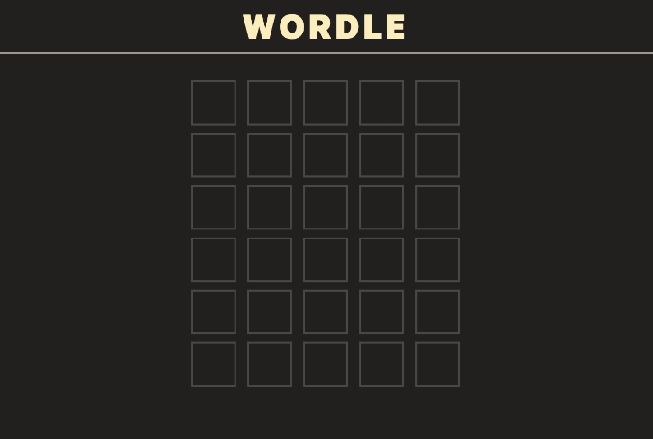

# Wordle

<a href="https://github.com/graceyu0725/Wordle?tab=readme-ov-file#about-wordle">About</a>
|
<a href="https://github.com/graceyu0725/Wordle?tab=readme-ov-file#demo">Demo</a>
|
<a href="https://github.com/graceyu0725/Wordle?tab=readme-ov-file#contact">Contact</a>

# Wordle

Recreated the iconic Wordle, the globally renowned word-guessing game, capturing its engaging and intuitive fun.

[Live Demo](https://grace-wordle.web.app/)

## About Wordle

- Developed with `TypeScript` to ensure static typing and improve code maintainability
- Utilized `Tailwind CSS` and `Tailwind CSS Animated` to create vibrant user interface and animation
- Managed global states with `useReducer`
- Completed website deployment with `Firebase Hosting`

## Built with

## Demo

## Contact

  
  
